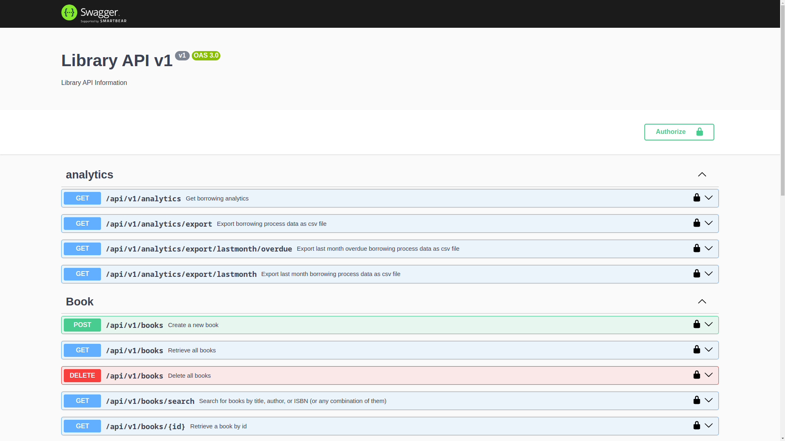
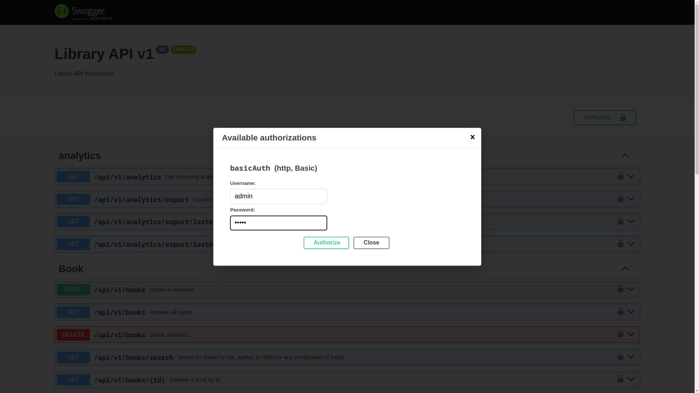

# Library Management System Backend using Nodejs, MySQL, Express and Sequelize

## API Documentation

The API documentation is available at [http://localhost:3000/api/v1/docs/](http://localhost:3000/api/v1/docs/) after running the project.

## Notes: 
- You can find the automated test scripts for the `/api/v1/health` and `/api/v1/users` endpoints in the `test/health.test.js` and `test/users.test.js` files respectively.
- The tests are written using [Pactum.js](https://pactumjs.github.io/) and [Mocha](https://mochajs.org/).
- You can find the seed script in the `seeders/seed.js` file.
- You can find the database schema in the `models` folder.
- You can find the Authentication middleware in the `middlewares/auth.js` file.
- The Authentication middleware is applied to all endpoints except the `/api/v1/health` endpoint.
- The Basic Auth credentials are:
    - Username: `admin`
    - Password: `admin`
- You can find the Docker Compose configuration in the `docker-compose.yml` file.
- You can find the Dockerfile in the `Dockerfile` file.
- You can also find the Docker image uploaded to Docker Hub [here](https://hub.docker.com/r/a7medayman6/library-management-system/general).
- You can find helper bash scripts in the `scripts` folder.
- You can find the rate limiter middleware in the `middlewares/rateLimiter.js` file.
- The rate limiter is set to allow 100 requests per minute per IP address to prevent DDoS attacks.
- The rate limiter is applied to all endpoints except the `/api/v1/health` endpoint.
- The API can export analytical data about the borrowings in a period of time to a CSV file, from the endpoints `/api/v1/analytics/export` and `/api/v1/analytics/export/lastmonth` and `/api/v1/analytics/export/lastmonth/overdue` 
- The system can easily be scaled horizontally by running multiple instances/containers of the backend server and using a load balancer to distribute the requests between the instances.
- The system uses a relational database (MySQL) to store the data.
- The system uses an ORM (Sequelize) to interact with the database, to prevent SQL injection attacks, and any other DB security vulnerabilities, and to make it easier to switch to another database providers.

## Project structure


```
.
├── config                  # Configuration files 
├── controllers             # Route controllers (controller layer)
├── imgs                    # README.md images
├── middleware              # Express middlewares (authentication, rate limiter)
├── models                  # Database schema and models for Sequelize ORM
├── requests                # REST Client vscode extension requests
│   └── endpoints
│       ├── books
│       ├── checkouts
│       ├── health
│       ├── return
│       └── users
├── routes                  # Routes 
├── scripts                 # Helper bash scripts 
├── seeders                 # Seeding scripts
├── tests                   # Automated tests using Pactum.js
│   └── api
│       ├── health
│       └── users
└── util                    # Utility functions (Swagger, Logger)
```

## Project Setup

### Using Docker Compose on Linux

- Make sure you have docker and docker-compose installed on your system, if not, follow the instructions [here](https://docs.docker.com/engine/install/) 

- Start up mysql database
> NOTE: if you want the database to be persistent on your system uncomment `db` service volumes in the `docker-compose.yml` file

```bash
docker-compose up -d db
```

- Use the followeing command to watch the logs of the backend container untill you make sure the database is up and running, then press `ctrl + c` to exit
```bash
docker compose logs --no-log-prefix -f db
# [Server] /usr/sbin/mysqld: ready for connections. Version: '8.0.34'  socket: '/var/run/mysqld/mysqld.sock'  port: 3306  MySQL Community Server - GPL.
# ^Ccanceled
```

- Start up the backend server
```bash
docker compose up -d backend
```

- Use the followeing command to watch the logs of the backend container untill you make sure the server is up and running, then press `ctrl + c` to exit
```bash
docker compose logs --no-log-prefix -f backend
```


You can now access the API Swagger Documentation at [http://localhost:3000/api/v1/docs/](http://localhost:3000/api/v1/docs/)



The Basic Auth credentials are:
Username: `admin`
Password: `admin`

- Set the Username and Password in the Swagger UI to `admin` and `admin` respectively and click on `Authorize` button to authorize the requests:  



- Seed the database by hitting the create endpoints from `seeders/seed.js` script, run the following command
```bash
docker compose up seed
```

- Run automated tests for `/api/v1/health` and `/api/v1/users` endpoints
```bash
docker compose up test
```

### Using Convenient Shell Scripts with Docker Compose on Linux

- Make sure you have docker and docker-compose installed on your system, if not, follow the instructions [here](https://docs.docker.com/engine/install/)

- Run the following provision script to start up the database, backend server and seed the database with the initial data
> Note: if you want the database to be persistent on your system uncomment `db` service volumes in the `docker-compose.yml` file
> Note: If the script fails to run the first time, try running it again, because the database might not be ready yet

```bash
./scripts/docker.provision.sh
```

You can now access the API Swagger Documentation at [http://localhost:3000/api/v1/docs/](http://localhost:3000/api/v1/docs/)


The Basic Auth credentials are:
Username: `admin`
Password: `admin`

- Set the Username and Password in the Swagger UI to `admin` and `admin` respectively and click on `Authorize` button to authorize the requests:  


- Run the following script to run the automated tests for `/api/v1/health` and `/api/v1/users` endpoints
```bash
./scripts/docker.test.sh
```

- Run the following script to stop and remove the containers
```bash
./scripts/docker.clean.sh
```

### Using npm

- Make sure you have nodejs and npm installed on your system, if not, follow the instructions [here](https://nodejs.org/en/download/)

- Make sure you have mysql installed on your system, or you can use docker compose to start up a mysql database.
> NOTE: if you will not use docker compose, make sure you have a mysql database with the name `library-management-system-db` and set the `DB_HOST`, `DB_USER`, `DB_PASSWORD` and `DB_NAME` environment variables in the `.env` file to match your database credentials.

```bash
docker compose up -d db
```

- Use the followeing command to watch the logs of the database container untill you make sure the database is up and running, then press `ctrl + c` to exit

```bash
docker compose logs --no-log-prefix -f db
# [Server] /usr/sbin/mysqld: ready for connections. Version: '8.0.34'  socket: '/var/run/mysqld/mysqld.sock'  port: 3306  MySQL Community Server - GPL.
# ^Ccanceled
```

- Install the npm packages

```bash
npm install
```

- Start the server

```bash
npm start
# or in development mode
npm run dev
```

You can now access the API Swagger Documentation at [http://localhost:3000/api/v1/docs/](http://localhost:3000/api/v1/docs/)


The Basic Auth credentials are:

Username: `admin`
Password: `admin`


- Set the Username and Password in the Swagger UI to `admin` and `admin` respectively and click on `Authorize` button to authorize the requests


- Seed the database by hitting the create endpoints, run the following command

```bash
npm run seed
```

- Run automated tests for `/api/v1/health` and `/api/v1/users` endpoints

```bash
npm run test
```

